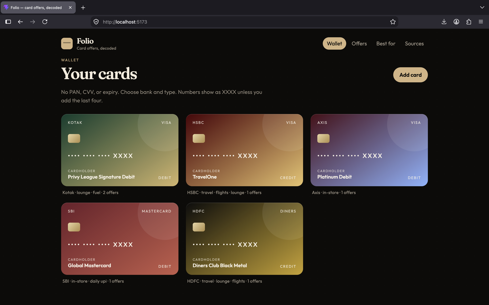
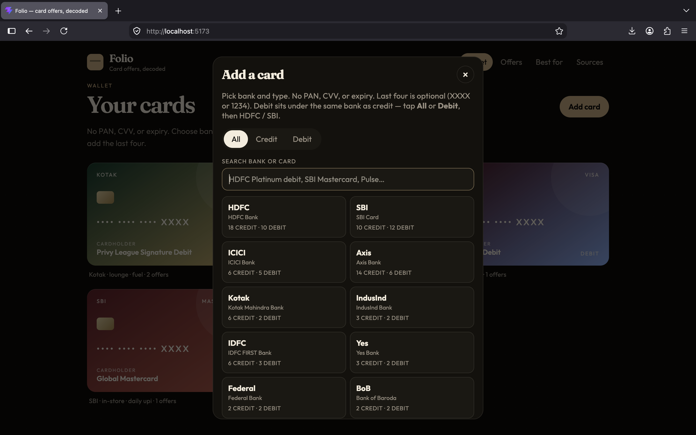
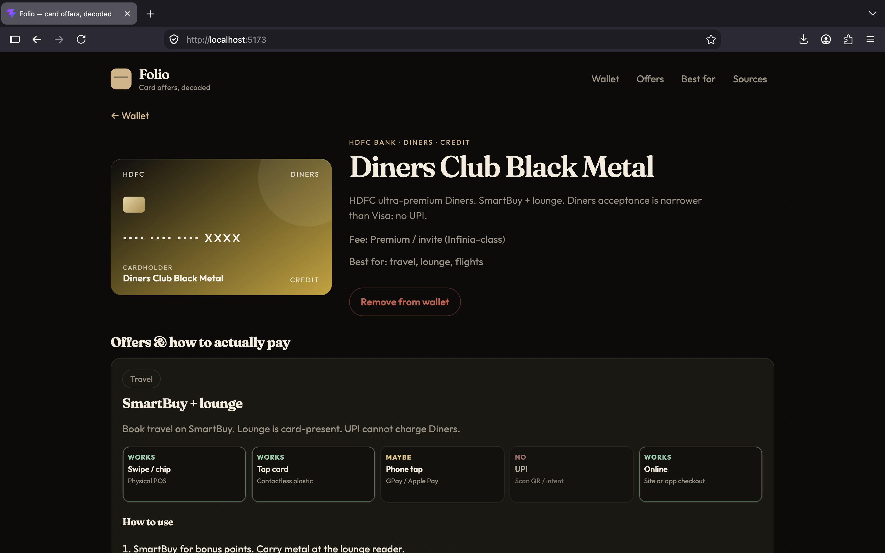
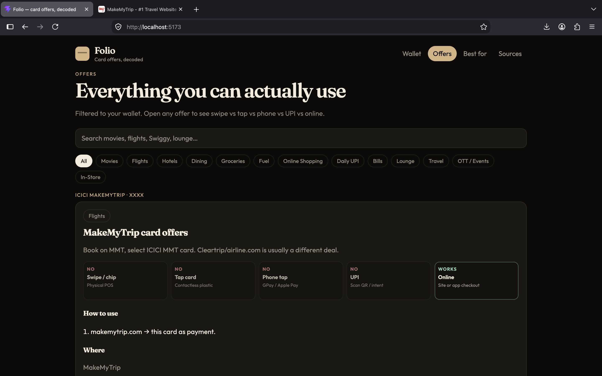
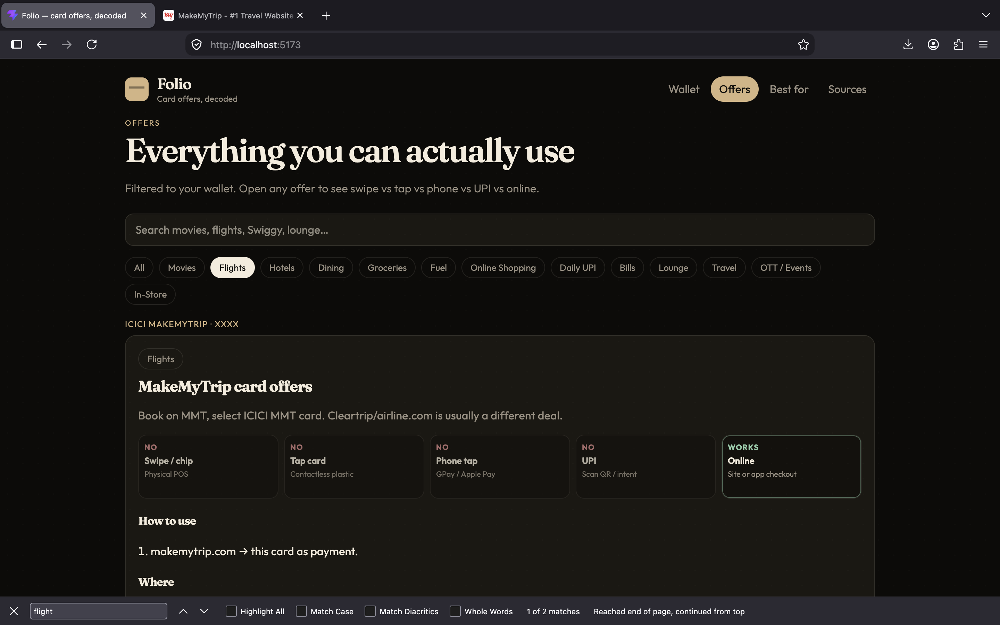
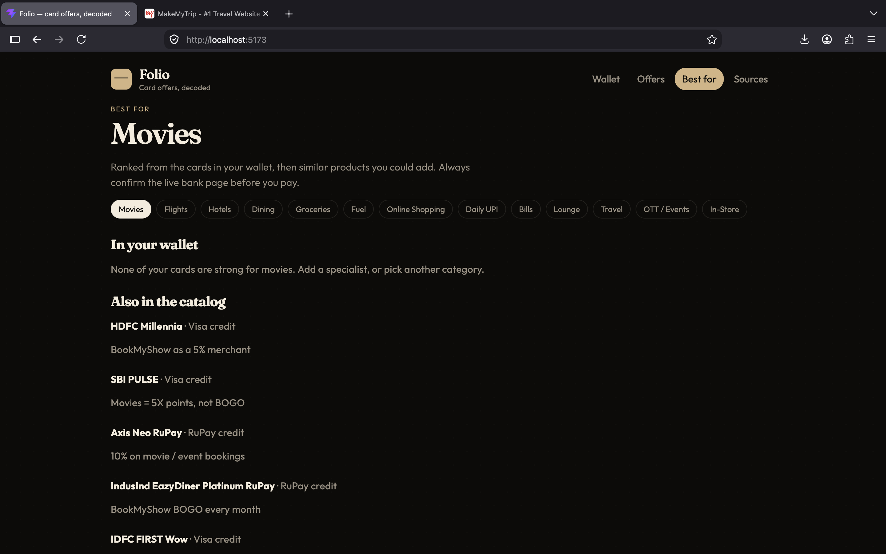
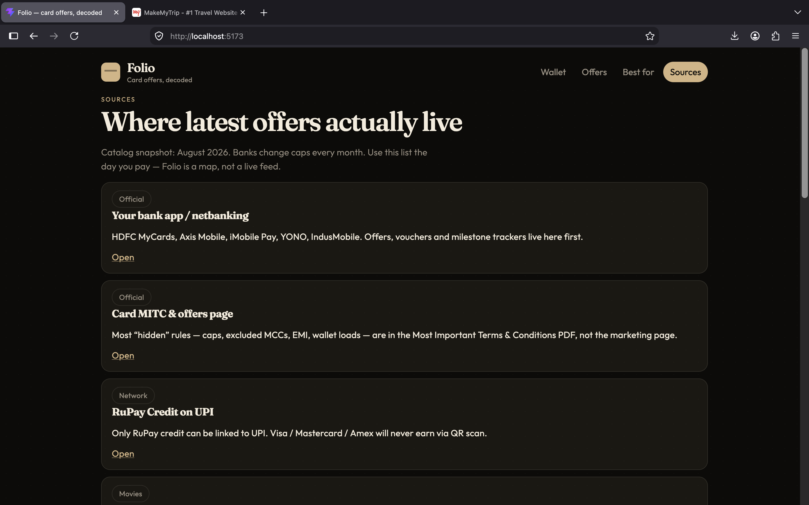

# Folio — card offers, decoded

Folio is a local web app for tracking **Indian credit and debit cards** by **bank + card type** only. You never enter PAN, CVV, or expiry. Numbers show as `•••• •••• •••• XXXX`, or as `1234` if you add the last four.

For each offer it shows:

- **How to use** — checkout steps
- **Where** — BookMyShow, Swiggy, SmartBuy, lounge, UPI QR, and so on
- **Whether it actually pays** — swipe / chip, tap card, phone tap (GPay / Apple Pay), UPI, or online
- **Hidden details** — caps, EMI/wallet exclusions, MCC traps

Wallet data stays in **this browser** (`localStorage`). Card and app offers load from the bundled catalog plus `public/live-offers.json` (fetched when Folio opens). Caps still move inside each bank/app — confirm the live tile before you pay.

---

## Screenshots

### Wallet

Your cards as plastics. Tap a card for offers.



### Add a card

Choose **All / Credit / Debit**, search (for example `HDFC Platinum debit` or `SBI Mastercard`), or pick a bank. Debit is listed first under each bank.



### Card detail

Payment rails for that product: Works / Maybe / No. Open **Hidden details & traps** for the fine print.



### Offers

Every offer on cards in your wallet. Search or filter by movies, flights, UPI, lounge, and more.





### Apps

Amazon Pay, POP, CRED, GPay, PhonePe, Paytm, Tata Neu, CheQ. Add the apps you use (same as adding cards). On **Offers** and **Best for**, use **All / Cards / Apps** to mix or split those lists.

### Best for

Ranks your wallet for a category (movies, flights, dining…), then suggests catalog cards you could add.



### Sources

Where live offers actually sit: bank apps, MITC, RuPay credit on UPI, BookMyShow, MMT, aggregators.



---

## Run locally

Needs [Node.js](https://nodejs.org/) 20+ and npm.

```bash
git clone <this-repo>
cd Cards\&Apps_OfferTracker
npm install
npm run dev
```

Vite prints two URLs:

```
➜  Local:   http://localhost:5173/
➜  Network: http://192.168.x.x:5173/
```

### Desktop

1. Open **http://localhost:5173/** in Chrome, Safari, Firefox, or Edge.
2. **Add card** → pick bank and type (optional last 4).
3. Use **Wallet**, **Apps**, **Offers**, **Best for**, **Sources**, and **Backup**.
4. The wallet is stored only in that browser profile. A different browser or a private window starts empty. Use **Backup** to download JSON and restore on another device.

### Phone (same Wi‑Fi)

1. Laptop and phone on the **same Wi‑Fi**.
2. Start the app with `npm run dev` (network listen is on).
3. On the phone browser, open the **Network** URL from the terminal, for example `http://192.168.1.24:5173/` — not `localhost` (that is the phone itself).
4. If it does not load, allow Node/Vite through the Mac firewall, or run:

   ```bash
   npm run dev -- --host
   ```

5. Add cards on the phone the same way. Phone and desktop wallets are **separate** — each device has its own `localStorage`. To copy a wallet: **Backup** → Download backup on one device, then Merge or Replace from that file on the other.

To stop the server: `Ctrl+C` in the terminal.

### Production preview (optional)

```bash
npm run build
npm run preview
```

Then open the Local / Network URLs Vite prints (preview port may differ from 5173).

---

## How to use the app

| Tab | What it does |
| --- | --- |
| **Wallet** | Cards you hold. Tap one for offers and payment rules. **Backup** in the header opens the backup tab. |
| **Apps** | Pay apps you use. **Add app** like adding a card — CRED, GPay, PhonePe, Tata Neu, and the rest. |
| **Offers** | **All** mixes card + app offers; **Cards** / **Apps** show one type. Then filter by movies, UPI, bills… |
| **Best for** | Same **All / Cards / Apps** tabs, then rank for movies, flights, dining, UPI, and so on. |
| **Sources** | Official places to re-check offers the day you pay. |
| **Backup** | Download or copy JSON (cards + apps); merge or replace from a file; restore card snapshots. |

**Add card:** no full card number. Last four is optional. Credit and debit live under the same bank.

**UPI:** only **RuPay credit** can use a credit line on QR. Visa / Mastercard / Amex never. Debit UPI spends the **bank account**, not the plastic — debit lounge/movie offers almost never follow a QR.

### Apps & live offers

CRED, PhonePe, Amazon and the rest do not publish a public coupon API, so Folio cannot scrape their private feeds. On every launch it:

1. Shows the bundled app + card catalog immediately.
2. Fetches `live-offers.json` (same origin; optional `VITE_LIVE_OFFERS_URL` for a remote JSON you host).
3. Merges those overlays onto apps and cards (offers marked **Live**).
4. Ranks **which wallet card to use** on each app you added (and flags traps like Paytm wallet load).

Update `public/live-offers.json` and hit **Refresh** (or reload) to pick up new coupons without waiting for a catalog rewrite. Always confirm the in-app tile the day you pay.

### Backup (laptop ↔ phone)

Cards live only in that browser. To move them:

1. Open **Backup** (top nav, bottom bar on phone, or the **Backup** button on Wallet).
2. **Download backup** — a `folio-wallet-YYYY-MM-DD.json` file (bank, type, nickname, last four only).
3. On the other device, **Merge from file** (adds missing cards) or **Replace from file** (wipes this browser’s wallet and loads the file).
4. Automatic **snapshots** keep the last 8 versions in this browser for undo. They disappear if you clear site data — keep a downloaded file for a real copy.

---

## Privacy

Folio does not send card data to a server. Nothing leaves the machine except what you type in the browser. Do not store full PAN or CVV anywhere in this app.
